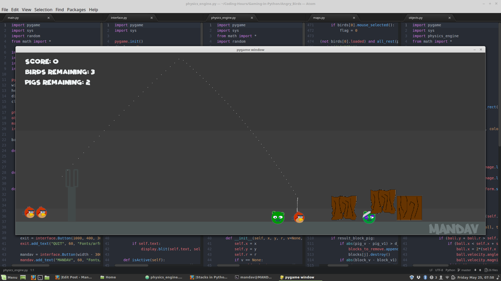
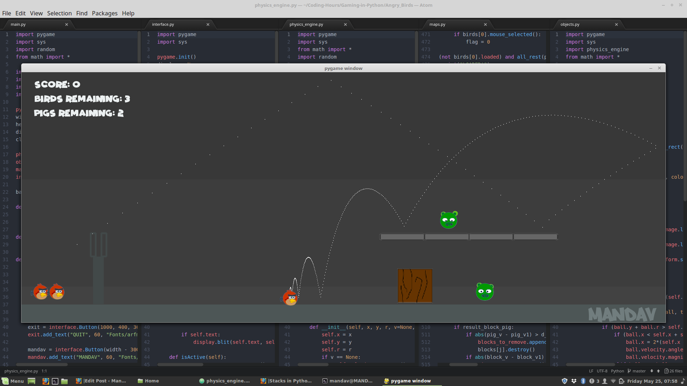

# Angry Birds

Here is a Small Attempt to Recreate One of the popular Games, Angry Birds in Python using Pygame

Link to 14 Hour Time Lapse of coding the game from Scratch: [Angry Birds - 14 Hour Time Lapse](https://youtu.be/6in-mdiumcA)

Link to Blog: [Angry Birds in Python Using PyGame](https://jatinmandav.wordpress.com/2018/05/25/angry-birds-in-python-using-pygame/)

### Requirements:

[Pygame Module](https://www.pygame.org)

    pip install pygame

## Usage:

    wget https://github.com/jatinmandav/Gaming-in-Python/tree/master/Angry_Birds
    
From Angry_Birds/ Directory:

    $ python3 main.py  or
    
    $ python main.py

### Game Play Screenshot:

  
  

  
  

